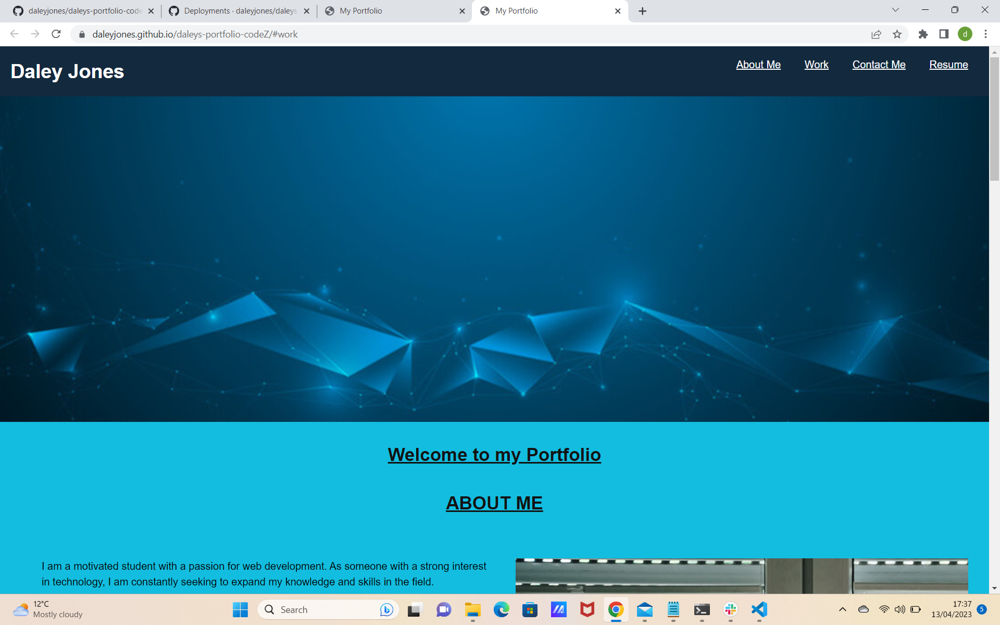

## Daley Jones Portfolio
This is my personal portfolio website showcasing my web development projects. It is built using HTML, CSS.

## Features
This portfolio includes the following features:
Technologies Used: HTML , CSS
Home section with an introduction and profile picture.
Project section showcasing my web development projects with images, and links.
Contact section with my contact information and social media accounts.
Responsive design for optimal viewing experience on different devices.

## Installation

A code editor of your choice (e.g., VSCode, Sublime Text)
A web browser (e.g., Chrome, Firefox)

You can clone the repository to your local machine using a Git client or by downloading the ZIP file from the GitHub repository. Open your terminal or command prompt.
1. git clone https://github.com/yourusername/portfolio.git
2. Open the project: Once the repository is cloned, navigate to the project directory using the command line or file explorer.
3. cd portfolio
4. Open index.html: Using your preferred code editor, open the index.html file, which is the main HTML file for the portfolio project.

5. Customize the content: Update the index.html file with your own information, such as your name, profile picture, project details, skills, and contact information. You can also customize the styles in the style.css file to match your personal branding.

6. Preview in a web browser: Open the index.html file in a web browser of your choice to preview the portfolio. You can do this by right-clicking on the index.html file and selecting "Open with" and then choosing your web browser.

7. Make further modifications (optional): If needed, you can make further modifications to the project, such as adding additional pages, updating the JavaScript (if used), or customizing the contact form.

8. Deploy (optional): If you want to deploy your portfolio website online, you can choose a hosting provider (such as GitHub Pages, Netlify, or Firebase) and follow their instructions to deploy your project.

9. That's it! You now have the portfolio project installed and running on your local development environment. You can continue to customize and modify it to suit your needs, and preview the changes in your web browser. Happy coding!

## Usage
You can use this portfolio as a template for creating your own personal portfolio. Here's how:

Fork the repository or download the source code.
Replace the content in the index.html file with your own information, including your name, profile picture, project details, skills, and contact information.
Customize the styles in the style.css file to match your personal branding.
Add your own web development projects by adding project images, descriptions, and links in the index.html file.
Customize the contact form to suit your needs, such as adding form validation or connecting it to a backend server for data submission.
Contributing
Contributions to this portfolio are welcome! If you find any issues or have suggestions for improvements, please create a pull request or open an issue in the repository.

## License
This portfolio is open-source and available under the MIT License.

## Contact Information
If you have any questions or would like to get in touch with me, please contact me at djones_157@hotmail.com You can also visit my website at https://daleyjones.github.io/daleys-portfolio-codeZ/#work for more information about me and my projects.

## portfolio image

Thank you for visiting my portfolio!

